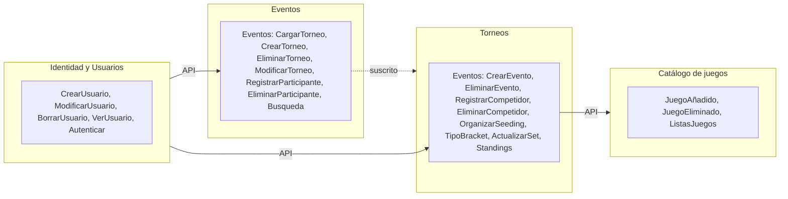
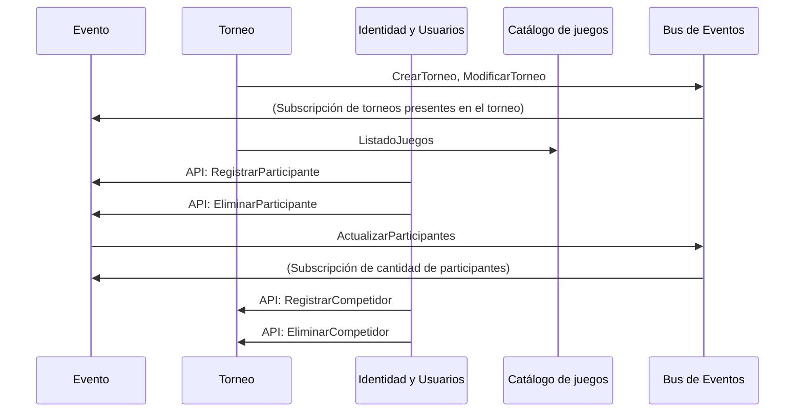

# Tarea 1: Página de torneos

## Tabla de contenidos

- [Contextos y documentación](#contextos-y-documentación)
- [Diagrama: interacción entre contextos](#diagrama-interacción-entre-contextos)
- [Flujo de eventos (secuencia)](#flujo-de-eventos-secuencia)

## Contextos y documentación

| Contexto             | Responsabilidad                                    | Documentación |
| -------------------- | -------------------------------------------------- | ------------- |
| Eventos              | Gestionar el evento que se hará                    | futuro        |
| Torneos              | Gestionar los torneos que se realicen en un evento | futuro        |
| Catálogo de juegos   | Catálogo de juegos que se le puede hacer un evento | futuro        |
| Identidad y Usuarios | Usuario interesado a ingresar a un evento          | Futuro        |

## Diagrama: Interacción entre contextos

- **Líneas sólidas**: Consultas realizadas por API
- **Líneas punteadas**: Eventos

## Flujo de eventos (secuencia)

## Eventos por contexto

| Contexto                   | Emite                                            | Consume                                                                                  |
| -------------------------- | ------------------------------------------------ | ---------------------------------------------------------------------------------------- |
| **Catálogo juegos**        | JuegoCreado                                      | JuegoEliminado                                                                           |
| **Evento**                 | EventoCreado, EventoModificado, EventoModificado | TorneoCreado, TorneoEliminado                                                            |
| **Torneo**                 | TorneoCreado, TorneoModificado, TorneoEliminado  | -                                                                                        |
| ** Identidad y Usuarios ** | -                                                | ParticipanteRegistrado, ParticipanteEliminado, CompetidorRegistrado, CompetidorEliminado |
