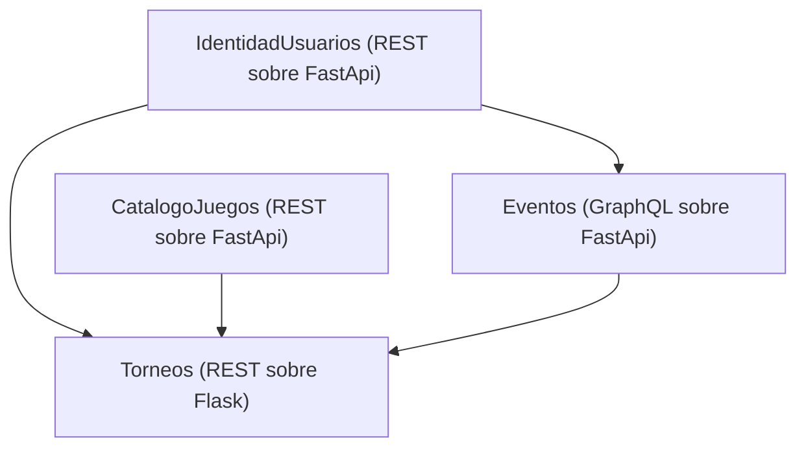

# Tarea 2: REST y GraphQL para la página de torneos

## Diagrama

## URLs de los servicios

- URL del servicio de Catalogo de juegos: [http://localhost:9090/docs](http://localhost:9090/docs)
- URL del servicio de Eventos: [http://localhost:8000/graphql](http://localhost:8000/graphql)
- URL del servicio de Identidad de Usuarios: [http://localhost:8003/docs](http://localhost:8003/docs)
- URL del servicio de Torneos: [http://localhost:8004/docs](http://localhost:8004/docs)
